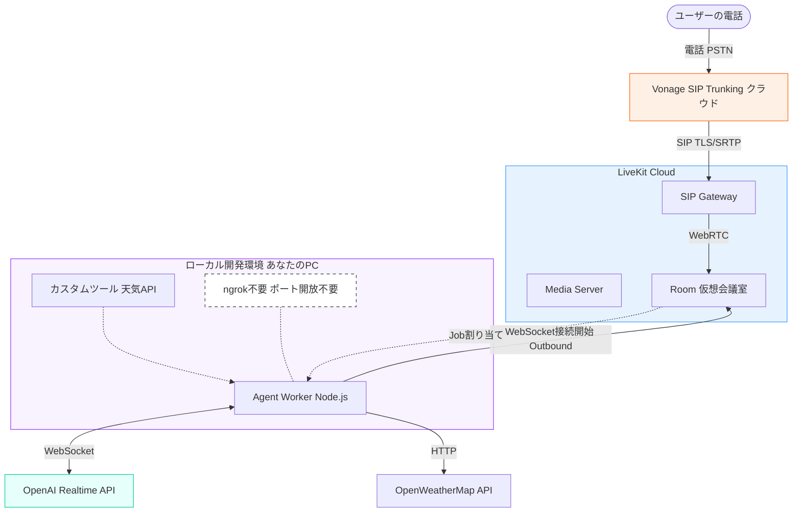

# Vonage LiveKit AI Agent

Vonage SIP Trunking、LiveKit Cloud、OpenAI Realtime API を組み合わせた、リアルタイム音声AIエージェントのサンプルプロジェクトです。
電話をかけると、AIエージェントが応答し、OpenAIのGPT-4o Realtimeモデルを使用して自然な会話を行います。

## 📋 前提条件

*   **Node.js**: v20以上
*   **Vonage アカウント**: SIP Trunking機能と電話番号が必要です。
*   **LiveKit Cloud アカウント**: 音声ストリーミング基盤として使用します。
*   **OpenAI API Key**: `gpt-4o-realtime-preview` モデルへのアクセス権限が必要です。

## 🏗️ アーキテクチャ

本プロジェクトのシステム構成図です。



## 🚀 セットアップ手順

### 1. リポジトリのクローンとインストール

```bash
git clone https://github.com/mobilebiz/live-kit-agents.git
cd live-kit-agents
npm install
```

### 2. 環境変数の設定

`.env.example` (もしなければ新規作成) をコピーして `.env` を作成し、以下の変数を設定してください。

```bash
cp .env.example .env
```

**`.env` の内容:**

```env
LIVEKIT_URL=wss://<your-project>.livekit.cloud
LIVEKIT_API_KEY=<your-api-key>
LIVEKIT_API_SECRET=<your-api-secret>
OPENAI_API_KEY=<your-openai-api-key>
OPEN_WEATHER_API_KEY=<your-openweathermap-api-key>
```

*   **LIVEKIT_URL, API_KEY, SECRET**: LiveKit Cloudのダッシュボード (Settings > Keys) から取得します。
*   **OPENAI_API_KEY**: OpenAIのプラットフォームから取得します。
*   **OPEN_WEATHER_API_KEY**: [OpenWeatherMap](https://openweathermap.org/api) でアカウントを作成し、API Keyを取得します（無料プランで利用可能）。

### 3. LiveKit Cloud と Vonage の設定

詳細な設定手順は [live-kit-setup.md](./live-kit-setup.md) に記載されていますが、重要なポイントは以下の通りです。

#### LiveKit Cloud (Inbound Trunk)
*   **Allowed addresses**: `216.147.0.0/18, 168.100.64.0/1` (Vonage Singapore IP) ※リージョンに合わせて変更してください。
*   **Media encryption**: **Enabled** (必須)

#### LiveKit Cloud (Dispatch Rule)
*   **Trunk**: 作成したInbound Trunkを選択
*   **Dispatch to**: Room
*   **Room name**: `call-room`

#### Vonage (SIP Trunk)
*   **SIP URI**: `sip:<project-id>.sip.livekit.cloud`
*   **Transport**: **TLS** (必須)
*   **SRTP**: **Enabled** (必須)

> [!IMPORTANT]
> VonageはSRTP (音声暗号化) を強制するため、LiveKit CloudとVonageの両方で **SRTP/Media Encryption** を有効にし、SIP接続には **TLS** を使用する必要があります。これらが設定されていない場合、通話は即座に切断されます。

## ▶️ 実行方法

開発モードでエージェントを起動します：

```bash
npm run dev
```

起動後、Vonageで購入した電話番号に電話をかけると、エージェントが応答します。

## 🔧 Function Calling（ツール機能）

このエージェントは、OpenAI Realtime APIのFunction Calling機能をサポートしています。
AIが必要に応じて外部ツールを呼び出し、情報を取得したり、アクションを実行したりできます。

### 利用可能なツール

#### `get_weather`
指定された場所の天気情報をOpenWeatherMap APIから取得します。

**使用例**:
- 「今日の東京の天気は？」
- 「大阪の天気を教えて」

**注意**: OpenWeatherMap API Keyが必要です。`.env` ファイルに `OPEN_WEATHER_API_KEY` を設定してください。

### カスタムツールの追加

新しいツールを追加するには、以下の手順に従ってください：

1. **ツールファイルの作成**

`weather-tool.js` を参考に、新しいツールファイルを作成します：

```javascript
import { llm } from "@livekit/agents";

export const myCustomTool = llm.tool({
  description: "ツールの説明（AIがツールを使うかどうかの判断に使用されます）",
  parameters: {
    type: "object",
    properties: {
      param1: {
        type: "string",
        description: "パラメータの説明",
      },
    },
    required: ["param1"],
  },
  execute: async ({ param1 }) => {
    // ツールのロジックを実装
    console.log(`Tool called with: ${param1}`);
    return "結果をテキストで返します";
  },
});
```

2. **agent.jsでツールをインポート**

```javascript
import { myCustomTool } from "./my-custom-tool.js";
```

3. **ツールを登録**

```javascript
const agent = new voice.Agent({
  // ...
  tools: {
    get_weather: weatherTool,
    my_custom_tool: myCustomTool, // 新しいツールを追加
  },
});
```

## 🧪 テスト

このプロジェクトでは、`vitest` を使用してユニットテストを実装しています。

### テストの実行

```bash
# すべてのテストを実行
npm test

# ウォッチモードでテストを実行（ファイル変更時に自動再実行）
npm run test:watch

# UIモードでテストを実行
npm run test:ui

# カバレッジレポートを生成
npm run test:coverage
```

### テストファイル

*   `weather-tool.test.js`: 天気情報取得ツールのユニットテスト
    - OpenWeatherMap APIのモック
    - 正常系・異常系のテストケース
    - エラーハンドリングのテスト

### カスタムツールのテスト

新しいツールを追加した場合は、対応するテストファイルも作成してください：

```javascript
import { describe, it, expect, vi } from 'vitest';
import { myCustomTool } from './my-custom-tool.js';

describe('My Custom Tool', () => {
  it('should execute correctly', async () => {
    const result = await myCustomTool.execute({ param1: 'test' });
    expect(result).toBeDefined();
  });
});
```

## 🛠️ トラブルシューティング

*   **電話がすぐ切れる**:
    *   VonageとLiveKit Cloudの両方で **SRTP (Media Encryption)** が有効になっているか確認してください。
    *   VonageのSIP URI設定で **Transport: TLS** が選択されているか確認してください。
    *   LiveKit CloudのInbound Trunk設定で、VonageのIPアドレスが **Allowed addresses** に含まれているか確認してください。
*   **エージェントが応答しない**:
    *   `node agent.js dev` が実行中であることを確認してください。
    *   `.env` ファイルのAPIキーが正しいか確認してください。

## 📂 ファイル構成

*   `agent.js`: AIエージェントのメインロジック。
*   `tools/`: 外部ツール定義ディレクトリ
    *   `weather-tool.js`: 天気情報取得ツール
*   `tests/`: テストコードディレクトリ
    *   `weather-tool.test.js`: 天気ツールのユニットテスト
*   `live-kit-setup.md`: LiveKit CloudとVonageの詳細な設定手順書。
*   `package.json`: プロジェクトの依存関係定義。
